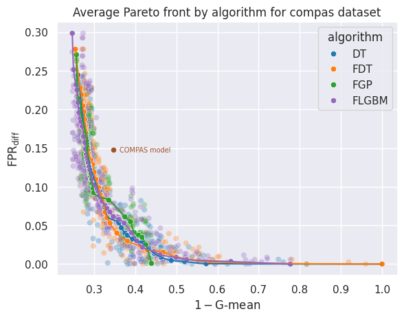
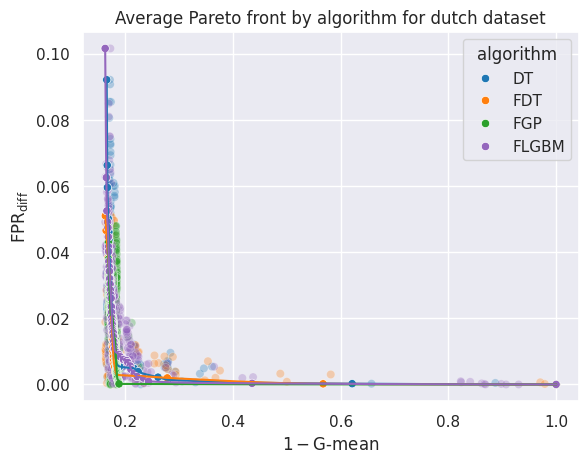
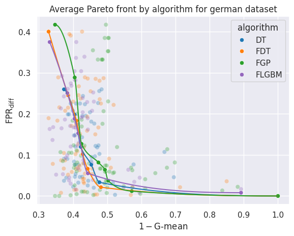
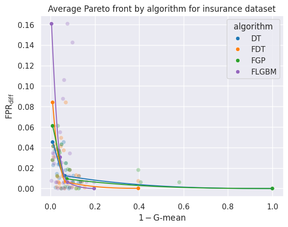
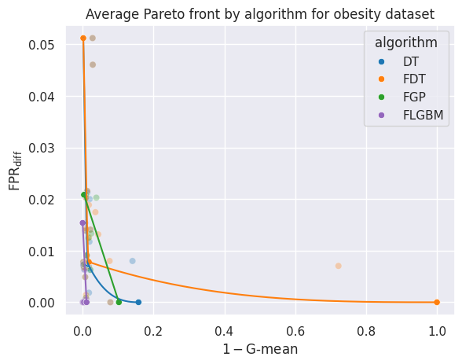
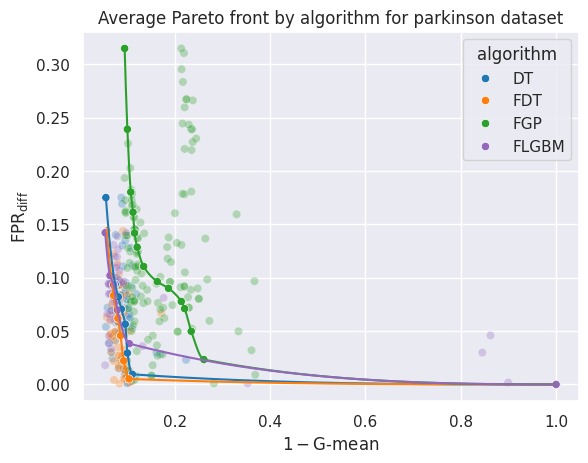
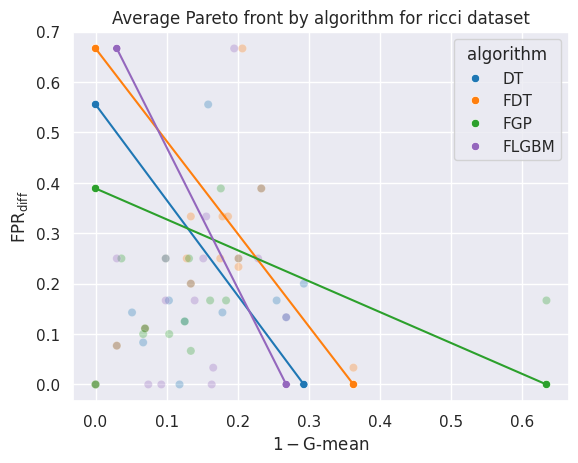
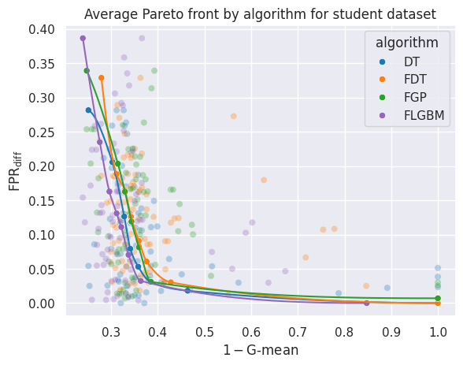
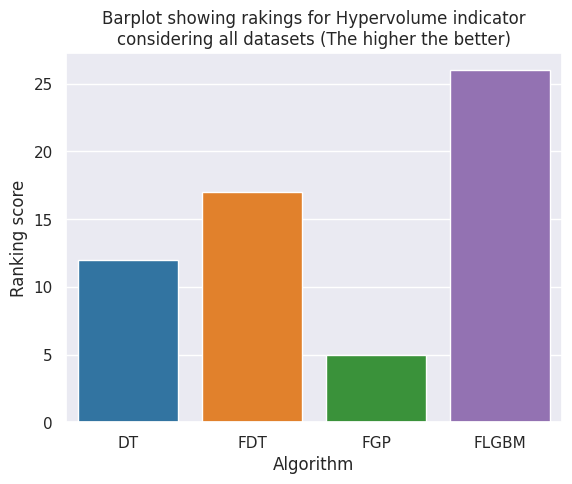
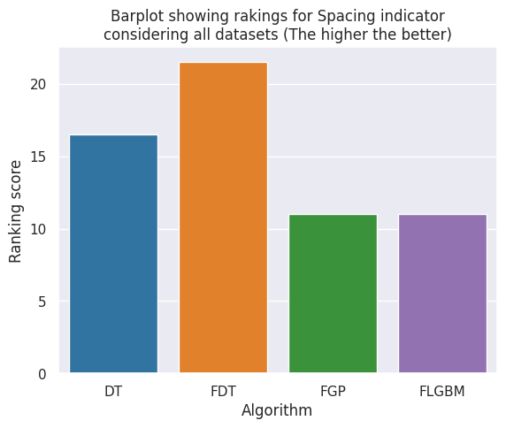

# Development of Fair Machine Learning Algorithms based on Decision Trees || Master's thesis

![Cython](https://img.shields.io/badge/cython-yellow.svg?logo=data:image/svg+xml;base64,PHN2ZyB4bWxucz0iaHR0cDovL3d3dy53My5vcmcvMjAwMC9zdmciIHdpZHRoPSI1MTIiIGhlaWdodD0iNTEyIiBzaGFwZS1yZW5kZXJpbmc9Imdlb21ldHJpY1ByZWNpc2lvbiIgaW1hZ2UtcmVuZGVyaW5nPSJvcHRpbWl6ZVF1YWxpdHkiIGZpbGwtcnVsZT0iZXZlbm9kZCIgZmlsbD0iI2VhZWJlYSIgeG1sbnM6dj0iaHR0cHM6Ly92ZWN0YS5pby9uYW5vIj48cGF0aCBkPSJNNTExLjUgMTQ3LjV2M2MtMzUuMzM1LjE2Ny03MC42NjggMC0xMDYtLjUtMjQuMjEzLTQ2LjEzMS02Mi4yMTMtNzMuMTMxLTExNC04MS00MC45MzEtNS41MTEtNzkuNTk4IDEuNDg5LTExNiAyMS0zMi40NDQgMjEuMTQtNTMuMjc4IDUwLjY0LTYyLjUgODguNS04LjgyMyA0Mi4xMjktOS44MjMgODQuNDYzLTMgMTI3IDcuMDM2IDQzLjkxMyAyNi41MzYgODEuMDc5IDU4LjUgMTExLjUgMjguMDc2IDIxLjk2OSA2MC4wNzYgMzIuNDY5IDk2IDMxLjUgMzguMTU3IDEuMzg3IDcyLjQ5MS05LjExMyAxMDMtMzEuNSAxMy4xNzMtMTEuMjA0IDIzLjg0LTI0LjM3IDMyLTM5LjVhMTcwMC41NiAxNzAwLjU2IDAgMCAxIDEwMS0uNWMtNDIuNTEzIDY3Ljk2NS0xMDMuODQ2IDEwNy4yOTgtMTg0IDExOC01NC4wMDYgNy41MTEtMTA3LjAwNiAzLjE3OC0xNTktMTNDODYuMTc3IDQ1NS4zNDQgMzcuNjc3IDQwNi4xNzcgMTIgMzM0LjVjLTYuMDUxLTIwLjA5LTEwLjIxNy00MC40MjMtMTIuNS02MXYtNDhjNS4wNzUtNTEuODEzIDI1LjU3NS05Ni40NzkgNjEuNS0xMzRDMTA4LjM3MyA0NC42OCAxNjUuNTQgMTguODQ3IDIzMi41IDE0YzU0LjQ4Mi01LjM2IDEwNy4xNDkgMS45NzQgMTU4IDIyIDUzLjMyNCAyMy4xNiA5My42NTcgNjAuMzI3IDEyMSAxMTEuNXoiIG9wYWNpdHk9Ii45ODMiLz48cGF0aCBkPSJNMjQ5LjUgMTAxLjVjMTQuMDA0LS4xNjcgMjguMDA0IDAgNDIgLjUgMTMuMjEyLjE3NCAyNS41NDUgMy41MDcgMzcgMTAgNy43NTYgNS42NjYgMTIuOTIyIDEzLjE2NiAxNS41IDIyLjUuNjY3IDI5IC42NjcgNTggMCA4Ny0zLjY2OCAxMy42NjctMTIuMTY4IDIyLjgzNC0yNS41IDI3LjVhMjE1MC4xOCAyMTUwLjE4IDAgMCAxLTkwIDJjLTIwLjIwMyAzLjg3MS0zMy4wMzcgMTUuNzA0LTM4LjUgMzUuNWEzNjQuMjcgMzY0LjI3IDAgMCAwLTEuNSA0M2MtNDAuNjA2IDcuNTQyLTYzLjEwNi05LjEyNS02Ny41LTUwLTQuNjY4LTI1LjY1Ny0yLjMzNC01MC42NTcgNy03NSA2LjI3Mi0xMi4yNjkgMTYuMTA1LTIwLjEwMiAyOS41LTIzLjUgMzcuNjMyLTEuNDYyIDc1LjI5OS0xLjk2MiAxMTMtMS41di04aC03M2E4NDAuMjcgODQwLjI3IDAgMCAxIC41LTQxYzIuMTM2LTEwLjEzOSA3Ljk2OS0xNy4zMDYgMTcuNS0yMS41IDExLjIyNS0zLjYwOSAyMi41NTgtNi4xMDkgMzQtNy41em0tMjMgMjNjMTIuMTUxLS4wMTUgMTcuMzE4IDUuOTg1IDE1LjUgMTgtMy44OTkgNy45NjktMTAuMDY2IDEwLjQ2OS0xOC41IDcuNS0xMC4wMTUtOS43MzYtOS4wMTUtMTguMjM2IDMtMjUuNXoiIG9wYWNpdHk9Ii45ODQiLz48cGF0aCBkPSJNMzUzLjUgMTc5LjVjMTEuMzM4LS4xNjcgMjIuNjcyIDAgMzQgLjUgMTMuNjA4IDMuNjA0IDIyLjc3NCAxMi4xMDQgMjcuNSAyNS41IDEzLjk3NSAzNy4yNzggMTEuOTc1IDczLjYxMS02IDEwOS00LjY3OSA3LjkxOS0xMS41MTIgMTIuNzUzLTIwLjUgMTQuNWwtMTE3IC41djloNzNjLjQyNSAxMy4zOTQtLjA3NSAyNi43MjctMS41IDQwLTMuNzc2IDguNzc2LTkuOTQyIDE1LjI3Ni0xOC41IDE5LjUtMzEuMDIgMTMuMzU3LTYyLjY4NyAxNS4wMjMtOTUgNS0xNS4zMTktNC4zMjYtMjUuODE5LTEzLjgyNi0zMS41LTI4LjUtLjY2Ny0yOC42NjctLjY2Ny01Ny4zMzMgMC04NiAzLjcwNy0xNC4yMzQgMTIuNTQtMjMuNzM0IDI2LjUtMjguNSAzMC4yOTktMS4yODYgNjAuNjMyLTEuOTUzIDkxLTIgMTkuMDg0LTQuNzUxIDMxLjI1LTE2LjU4NCAzNi41LTM1LjVhMzY0LjI3IDM2NC4yNyAwIDAgMCAxLjUtNDN6bS00NCAxNzhjMTIuODE1Ljk3MiAxNy42NDggNy42MzggMTQuNSAyMC01LjA2OCA3LjM2OC0xMS41NjggOC44NjgtMTkuNSA0LjUtNi4yMjktNi43MjUtNi41NjItMTMuNzI1LTEtMjEgMi4yMjctLjk0MSA0LjIyNy0yLjEwOCA2LTMuNXoiIG9wYWNpdHk9Ii45ODUiLz48L3N2Zz4=)

This repository contains the work done on the implementation and testing of three different multi-objective algorithms, which include methods for achieving a balance between accuracy and fairness. You can read the project report in the file [report.pdf](report.pdf).

## Brief descrition of developed algorithms
- **FairDT (FDT)**: Modification of the impurity criterion calculation during decision tree training to also consider fairness. Its general expression is:

$$(1-\lambda) * \text{gini/entropy} - \lambda * \text{fairness criterion} $$
- **Fair Genetic Pruning (FGP)**: Genetic pruning of a matrix decision tree (the largest decision tree that can be built to perfectly classify the training sample), so that each individual in the population is represented by the codes of the nodes where the prunings occur."
- **FairLGBM (FLGBM)**: Modification of the loss function in the LightGBM algorithm to incorporate fairness.

$$(1-\lambda) * \text{Logloss} + \lambda * \text{continuous fairness criterion} $$

## Brief description of the experimentation
The experimentation involved testing each algorithm with 10 datasets for binary classification that are well-known in the field of fairness in machine learning (adult, compas, diabetes, dutch, german, insurance, obesity, parkinson, ricci, and student), containing 1 binary protected attribute. To obtain robust and reproducible results, each experiment was run a total of 10 times with different values of the random seed (from 100 to 109), which controls the partitioning of data into training, validation, and test sets, as well as other pseudo-random processes. Average results were calculated from the outcomes obtained in each run for each algorithm. The experimentation was conducted with the three developed algorithms, as well as with a decision tree (DT).

The hyperparameters that define the decision space of each algorithm are as follows:

- **DT**:
    - **criterion**: gini / entropy.
    - **max_depth**: maximum depth of the tree.
    - **min_samples_split**: minimum number of samples required to split an internal node.
    - **max_leaf_nodes**: maximum number of leaf nodes the final tree can have.
    - **class_weight**: weight assigned to each class to be predicted.
- **FDT**:
    - **same parameters**, plus:
    - **fair_param**: parameter that controls the balance between the impurity criterion and the fairness criterion during tree learning.
- **FGP**
    - The method itself is a genetic algorithm that returns a large number of solutions. Instead of hyperparameter optimization of a base classifier, this method is applied directly.
- **FLGBM**
    - **num_leaves**: number of leaves in the tree.
    - **min_data_in_leaf**: minimum amount of data required in a leaf node to allow splitting.
    - **max_depth**: maximum depth of the tree.
    - **learning_rate**: learning rate of the algorithm.
    - **n_estimators**: number of weak classifiers to be built.
    - **feature_fraction**:  fraction of features used to build the model.
    - **fair_param**: controls the balance between the standard loss function (logloss) of the algorithm and the fairness function considered.

The objectives to minimize during the experimentation are as follows:

- **Inverted G-mean** (gmean_inv): The geometric mean criterion is defined as the square root of the product of the true positive rate and the true negative rate $(\sqrt{\text{TPR} \cdot \text{TNR}})$. Since it is a minimization objective, $1-\sqrt{\text{TPR} \cdot \text{TNR}}$ will be used.
- **Difference in False Positive Rate** (FPR$_{\text{diff}}$):  This is the difference between the probabilities $|P[p=1|Y=0,A=0]-P[p=1|Y=0,A=1]|$, where $p$ is the result of the classifier, $Y$ is the attribute to be predicted, and $A$ is the sensitive attribute.

## Main results

The results have shown that fairer and more accurate classifiers can be found using the employed algorithms than using a regular decision tree.

     
     

     
     

     
     

     
     

     
     

The rankings of the quality measures on the average Pareto fronts found can also be consulted here. At least one of the developed algorithms has outperformed the base algorithm in each of the quality measures of the studied solution sets.

     
     

     
     

     
     

     

## Libraries and dependencies:

Listed below are the libraries and dependencies required to run your own experiments. You can try using higher versions of all libraries except Cython:
- **python**=3.10.12
- **matplotlib**=3.8.3
- **pandas**=2.2.1
- **scikit-learn**=1.4.1.post1
- **pydotplus**=2.0.2
- **imblearn**
- **cython**=0.29.37
- **lightgbm**=4.3.0 (from the official lightgbm webpage)
- **seaborn**=0.13.2
- **pygmo**=2.19.5
<!-- conda create --name NAME conda-forge python=3.10.12 -->
<!-- conda activate NAME -->
<!-- pip install matplotlib -->
<!-- pip install pandas -->
<!-- pip install scikit-learn -->
<!-- pip install pydotplus -->
<!-- pip install imblearn -->
<!-- pip install cython=0.29.37 -->
<!-- execute build.sh inside /HyperparameterOptimization/models/FairDT -->
<!-- install lightgbm with cuda support from the lightgbm webpage -->
<!-- pip install seaborn -->
<!-- pip install pygmo -->

--- 

## Additional info
- **Author**: David Villar Martos
- **Contributors**: David Villar Martos
- **Project director**: Jorge Casillas Barranquero

